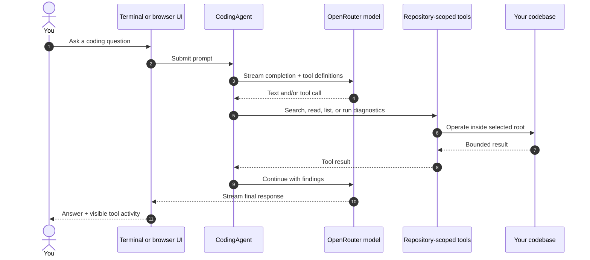
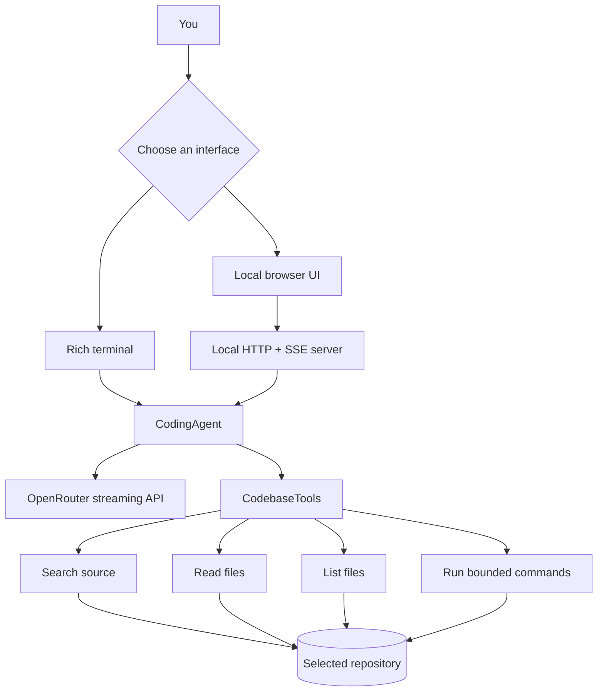

<div align="center">

# ✦ Pratham's AI Agent

### Your local, streaming AI partner for exploring and understanding any codebase.

[](https://www.python.org/)
[](https://openrouter.ai/)
[](#ways-to-work)
[](#privacy--safety)

<br />

> Ask natural-language questions about a repository. The agent searches source code, reads relevant files, explores structure, and runs bounded diagnostic commands while streaming its progress back to you.

</div>

---

## ✨ At a glance

| 🧠 Codebase-aware | ⚡ Streaming feedback | 🖥️ Two interfaces | 🔒 Repository-scoped |
| :--- | :--- | :--- | :--- |
| Searches and reads the project before answering. | See agent responses and tool activity as they happen. | Use a polished browser UI or a focused terminal workflow. | File access stays within the repository you selected. |

## Preview

```text
┌──────────────────────────────────────────────────────────────────────────────────┐
│ ✦ Pratham's Agent              Codebase assistant       ● Ready   ↓ Latest       │
├──────────────────────┬───────────────────────────────────────────────────────────┤
│ ＋ New conversation  │                                                           │
│                      │                 ✦ What can I help you build?              │
│ WORKSPACE            │                                                           │
│ ● Active repository  │  [ Understand project ]  [ Find a feature ]                │
│ /your/project        │  [ Investigate an issue ] [ Explore safely ]               │
│                      │                                                           │
│ AVAILABLE TOOLS      │                                                           │
│ ⌕ Search codebase    ├───────────────────────────────────────────────────────────┤
│ ◫ Read files         │ Ask about your codebase…                        🎙  ↑       │
│ ⌘ Run commands       │ Enter send · Shift + Enter newline                          │
│ ☷ Explore files      │                                                           │
└──────────────────────┴───────────────────────────────────────────────────────────┘
```

## What it can do

- **Understand unfamiliar projects** — request a concise overview, identify entry points, or map important files.
- **Locate implementation details** — search source code for a feature, symbol, configuration value, or error text.
- **Read source safely** — inspect text-based files up to configured size limits.
- **Explore project structure** — list files while automatically skipping common generated and dependency directories.
- **Run diagnostics** — execute bounded commands from the selected repository and show their output.
- **Keep context** — maintain a conversation per terminal session or browser session.
- **Work visually or in the shell** — choose the interface that fits your workflow.

## Ways to work

### 1. Browser workspace

Start the local server for a repository:

```bash
python ai.py /path/to/your/repository --web
```

Then open **[http://127.0.0.1:8000](http://127.0.0.1:8000)**.

The web workspace includes:

- Live answer and tool-result streaming
- A visible active-repository indicator
- Conversation reset and response count
- Scroll-to-latest control
- Browser voice input and optional voice output, where supported

### 2. Terminal workflow

Launch the interactive command-line agent:

```bash
python ai.py /path/to/your/repository
```

You can also use the installed command:

```bash
pratham-ai-agent /path/to/your/repository
```

#### Terminal commands

| Command | Action |
| :--- | :--- |
| `/help` | Show available terminal commands. |
| `/files` | List up to 100 repository files. |
| `/status` | Display session statistics. |
| `/clear` | Reset the current conversation. |
| `/exit` | Exit the agent. |

**Multiline prompts:** end a line with `\` and continue writing on the next prompt.

## Quick start

### Prerequisites

- Python **3.9+**
- An internet connection for model requests through OpenRouter

### Install

```bash
# Clone and enter the project
git clone <your-repository-url>
cd MY-AI

# Optional but recommended: isolate the installation
python3 -m venv .venv
source .venv/bin/activate

# Install the application and its dependencies
python -m pip install --upgrade pip
python -m pip install -e .
```

### Start it

```bash
# Inspect the current directory
python ai.py

# Inspect another repository in the terminal
python ai.py ~/projects/example-app

# Start the local browser interface on port 8000
python ai.py ~/projects/example-app --web
```

> **Port override:** Set `AGENT_PORT` before starting the browser interface, for example: `AGENT_PORT=8080 python ai.py . --web`.

## How a request flows



## Architecture



### Project layout

```text
MY-AI/
├── ai.py                    # Backward-compatible application entry point
├── pyproject.toml           # Packaging, dependencies, and CLI command
└── agent_app/
    ├── agent.py             # Streaming agent loop and tool-call handling
    ├── cli.py               # Rich-powered terminal interface
    ├── config.py            # Runtime limits, model, and repository policy
    ├── tools.py             # Safe, bounded repository operations
    ├── web.py               # Local HTTP, SSE, and session server
    └── static/
        ├── index.html       # Browser workspace markup
        ├── styles.css       # Visual design
        └── app.js           # Streaming chat and voice interactions
```

## Tool capabilities and limits

| Tool | Purpose | Built-in guardrails |
| :--- | :--- | :--- |
| `search_codebase` | Find text across source and configuration files. | Skips ignored directories, text files only, bounded results. |
| `read_file` | Read a repository file. | Rejects paths outside the repository and oversized files. |
| `list_files` | Browse repository files. | Skips generated/dependency directories and caps results. |
| `run_command` | Run a diagnostic, test, build, or Git command. | Runs from the repository root, has a time limit, blocks known destructive patterns. |

### Ignored by default

To keep exploration focused, the agent skips directories such as `.git`, `node_modules`, virtual environments, build outputs, caches, coverage directories, and common IDE metadata.

## Privacy & safety

- The browser server binds to **`127.0.0.1`**, so the UI is served from your machine only.
- Every file operation resolves against the repository selected at launch; requests outside that root are rejected.
- Browser sessions are held in memory, expire after four hours of inactivity, and are capped to prevent unbounded growth.
- Responses and tool output are size-limited to keep interactions responsive.
- Model requests are sent to the configured OpenRouter endpoint. Do not place secrets in prompts or repositories you do not intend to share with the model.

## Suggested prompts

```text
Give me a concise overview of this codebase and its entry points.

Where is user authentication implemented? Trace the relevant path.

Search for the code responsible for this error message: "Connection refused".

List the important files in this project and explain the responsibility of each.

Run the test suite and help me understand the first failure.
```

## Troubleshooting

| Symptom | What to check |
| :--- | :--- |
| `Repository does not exist` | Pass an existing directory path or run the command from inside the repository you want to inspect. |
| `Repository is not a directory` | The repository argument must point to a folder, not a single file. |
| Browser page does not open | Confirm the server is running, then visit `http://127.0.0.1:8000`. Check `AGENT_PORT` if you changed it. |
| Port is unavailable | Choose another port: `AGENT_PORT=8080 python ai.py . --web`. |
| Model request fails | Verify internet access and the application's OpenRouter configuration. The agent reports the provider error after retrying eligible failures. |
| A command times out | Commands are intentionally limited; run a narrower diagnostic or adjust the task. |

---

<div align="center">

Built for focused, local-first codebase exploration. ✦

</div>
